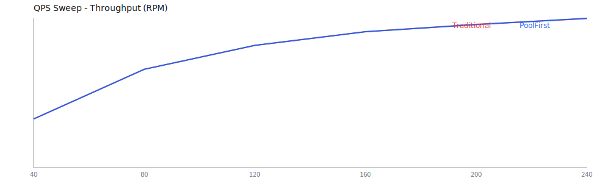
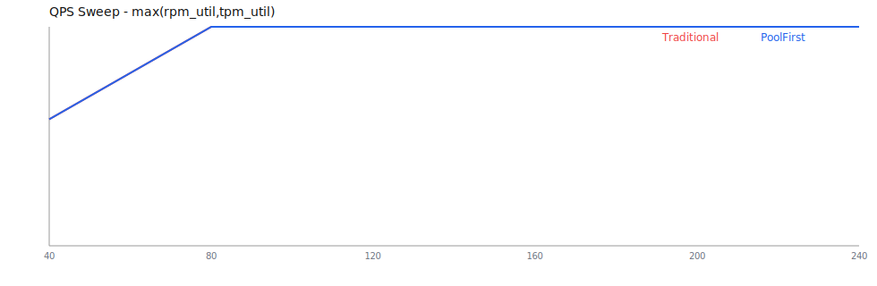
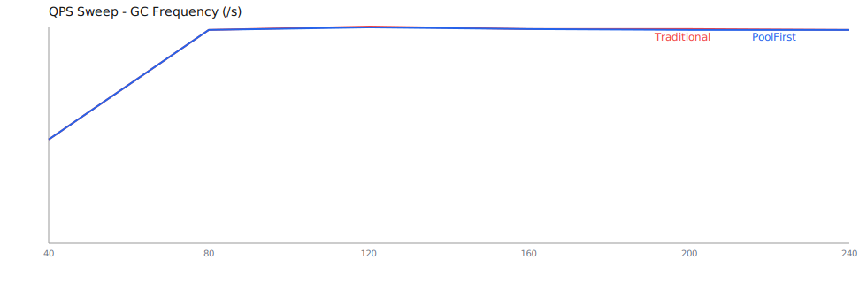
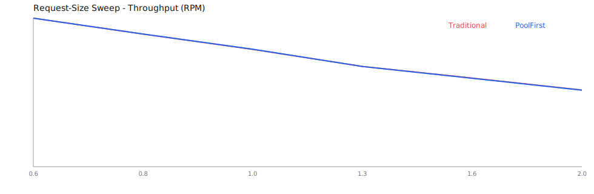
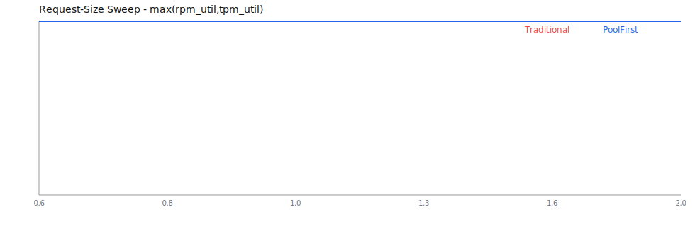
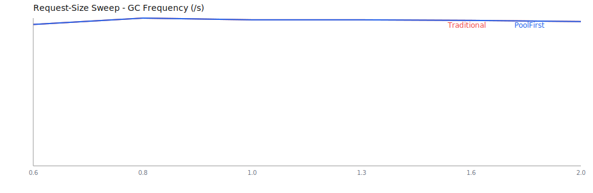
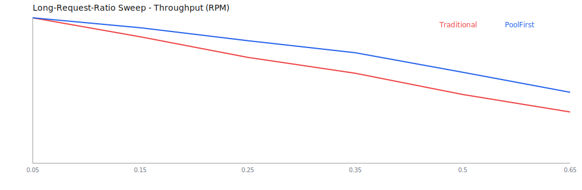
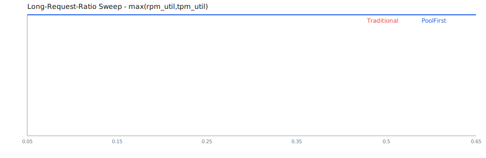
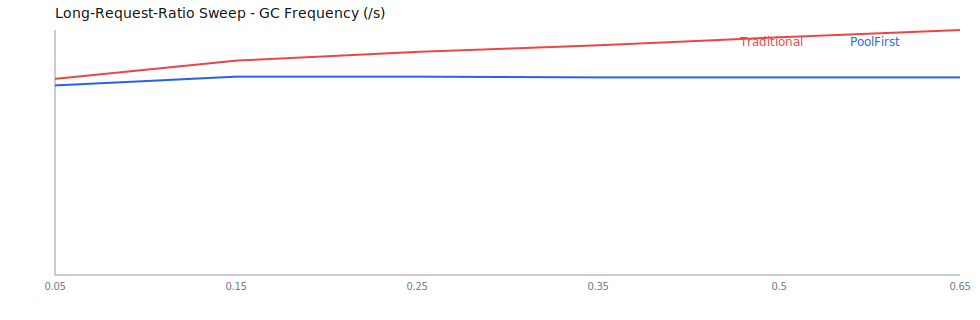

# 关于大模型fapi负载均衡算法的探究

## 引子：先对齐约束，再谈优化

大模型网关的负载均衡，首先不是一个“分流技巧”问题，而是一个“约束对齐”问题。  
在真实生产环境里，多数大模型厂商都以 `RPM`（每分钟请求数）和 `TPM`（每分钟 token 数）进行限流。  
如果网关调度不直接围绕这两个预算做决策，那么系统内部看似平衡，外部却仍会频繁触发限流，最终表现为吞吐下降、拒绝上升和尾延迟恶化。

基于这个前提，本文只讨论一套新范式：**以 RPM/TPM 为核心预算，以资源分配思想驱动负载均衡设计**。

---

## 一、问题重述：我们到底在分配什么

在大模型场景中，每个请求的成本差异很大。  
短请求可能只消耗几百 token，长请求可能消耗数千甚至上万 token。  
因此网关并不是在“平均分配请求”，而是在“分配有限预算”：

- 请求频率预算：`RPM`
- token 消耗预算：`TPM`

由此我们采用统一资源利用率指标：

`max(rpm_util, tpm_util)`

它表示当前系统最紧张维度的利用水平，也决定了系统距离极限还有多远。

---

## 二、新算法设计：从预算感知到策略分化

围绕 RPM/TPM 预算，我们实现了两类可热切换策略，并在同一仿真框架下进行对比。

### 1) Traditional（预算感知的基线策略）

- 随机采样实例
- 选择较低并发实例承接请求
- 严格预算校验（RPM/TPM 不足即拒绝或等待）

这类策略结构简单、行为稳定，适合作为基线。

### 2) Pool-First（资源复用优先策略）

- 通过对象池优先复用处理通道
- 结合预算校验进行接纳控制
- 在高压场景下采用更积极的排队与复用策略

其目标不是“盲目加速”，而是在预算不变前提下，降低资源抖动与分配开销，提升有效吞吐并抑制 GC 频率上升。

---

## 三、为什么会联想到“内存分配算法”

当我们持续观察压测数据后，会发现一个关键现象：  
请求长度分布变化时，系统表现往往比总流量变化更敏感。

这让问题自然转向“资源分配”视角：  
不同大小请求争夺同一预算池，和不同大小内存块争夺堆空间在结构上高度相似。

于是我们得到两点启发：

1. 不能只看总量，要看结构（短请求/长请求占比）
2. 不能固定切分，要允许分配边界随历史流量动态调整

基于这两点，形成了动态分桶（Adaptive Bucketing）思路：  
按历史 token 分布调整桶边界，再按各桶压力反馈调整份额，实现“流量结构变化 -> 分配策略变化”的自适应闭环。

---

## 四、实验方法：让差异在正确场景里被看见

为了避免“指标看起来都一样”的假象，实验不是只扫单一维度，而是分三层推进：

1. 负载强度扫描（QPS sweep）  
2. 请求规模扫描（request size sweep）  
3. 长请求占比扫描（long-ratio sweep）

实验关注四类指标：

- 吞吐：`actual_rpm`
- 资源逼近度：`max(rpm_util, tpm_util)`
- 稳定性成本：`gc_avg`
- 服务质量：`TTFT p95` 与 `reject_rate`

---

## 五、结果解读：差异出现在“结构压力”下

前两组实验说明：当瓶颈主要是统一预算上限时，不同策略可能都快速逼近上限，曲线接近并不意外。  
真正能拉开差距的是第三组——长请求占比持续上升的异构流量场景。

在 `long_ratio = 0.65` 时，代表性结果如下：

- Throughput（RPM）：Traditional `2633.47` vs Pool-First `3645.69`
- Reject rate：Traditional `0.6488` vs Pool-First `0.5138`
- GC frequency（/s）：Traditional `3.0270` vs Pool-First `2.4414`

这说明在“预算固定 + 结构变重”的压力下，Pool-First 在吞吐、拒绝率、GC 三个维度同时取得优势。  
与此同时，TTFT 尾部会因为策略偏好产生权衡，这提醒我们：**算法优化不是单指标最大化，而是目标函数选择**。

---

## 六、成果图展示

### 1) 负载强度扫描

### 2) 请求规模扫描

### 3) 长请求占比扫描（关键）

---

## 七、结论

这次探究的核心结论可以归纳为三句话：

1. 大模型网关负载均衡必须以 `RPM/TPM` 预算为第一原则。  
2. 只有把问题当成“资源分配”而非“请求分流”，才能解释并优化异构流量下的性能行为。  
3. 在长请求占比升高的真实压力场景中，Pool-First 显示出更强的吞吐韧性与更低的 GC 成本。

最终，我们得到的不是某一个“万能算法”，而是一套可验证、可解释、可调优的负载均衡方法论：  
**预算对齐 -> 结构感知 -> 策略分化 -> 指标闭环**。
# 关于大模型fapi负载均衡算法的探究

## 1. 背景与问题定义

在大模型网关场景中，单纯使用 `QPS` 作为负载指标很容易失真。  
更关键的是，很多大模型厂商本身就以 `RPM` 和 `TPM` 作为核心限流口径；网关如果不对齐这两个指标，调度策略与上游真实约束就会错位。  
同时，一次请求的真实成本主要由 `Token` 决定，且输入/输出长度波动很大。  
因此我们将系统负载模型从“请求数”升级为“请求数 + Token 消耗”双预算：

- `RPM`（Requests Per Minute）：控制请求频率预算
- `TPM`（Tokens Per Minute）：控制 Token 消耗预算

并以 `max(rpm_util, tpm_util)` 作为关键资源利用率指标，定义为系统当前最紧张资源维度的利用水平。

---

## 2. 从 QPS 到 RPM/TPM 的工程改造

改造目标：让网关调度与限流策略直接贴合大模型供应商实际约束。

- 实例侧能力字段从 `maxQps` 演进为 `rpmLimit`、`tpmLimit`、`maxConcurrency`
- 数据库、DTO、Mapper、管理页面同步升级，前后端统一以 RPM/TPM 视角配置
- 路由与调度阶段引入 token 估算，使每次分配都可感知“本次请求将消耗多少预算”
- 兼容旧字段，避免历史实例配置失效

这一步的意义是：**负载均衡从“流量均摊”转为“预算感知分配”**。

---

## 3. 资源分配视角：从负载均衡联想到内存分配

当我们把问题抽象为“在有限预算下分配不同大小请求”，它本质上接近资源分配/内存分配问题：

- 小请求与大请求并存，且比例动态变化
- 目标不是单一吞吐，而是吞吐、时延、拒绝率、GC 开销的综合平衡
- 固定切分（静态桶）会遇到“只命中部分桶”的利用不均问题

因此引入了“分桶 + 份额分配”思路，并进一步发展为：

### 动态分桶（Adaptive Bucketing）

- 按历史 token 分布动态调整桶边界（而不是写死阈值）
- 按各桶到达量、成功率、拒绝率、token 吞吐反馈，动态调整桶份额
- 增加抗振荡机制，避免参数频繁抖动

这套机制的初衷是提升异构流量下的适应能力，但在某些场景也暴露了代价：参数复杂度上升、保守策略可能牺牲吞吐。

---

## 4. 实验演进与关键发现

## 4.1 为什么早期“看不出差异”

在 `QPS` 扫描实验中，Traditional 与 Pool-First 曲线接近重合，原因并非算法真的等价，而是：

- 在该实验参数下，系统主要受全局 RPM/TPM 上限约束
- 两种算法都很快打满预算，`max_util` 同时接近 1
- 指标敏感性不足，无法充分放大机制差异

对应数据文件：`experiments/ab_simulator/outputs/qps_sweep_pool_vs_traditional.csv`

---

## 4.2 横轴改为“请求规模”后仍接近

将横轴改为请求规模（token size scale）后，差异仍偏小，说明在该配置下预算瓶颈仍主导行为。  
这一步验证了一个重要结论：**改横轴不一定足够，关键是改变流量结构压力点**。

对应数据文件：`experiments/ab_simulator/outputs/request_size_sweep_pool_vs_traditional.csv`

---

## 4.3 放大机制差异：长请求占比扫描（关键结果）

为了让机制差异可观测，我们新增“长请求占比”扫描实验：  
固定总体请求强度，逐步提高长请求比例，观察两算法在重负载异构流量下的分化。

对应数据文件：`experiments/ab_simulator/outputs/long_ratio_sweep_pool_vs_traditional.csv`

代表性结果如下：

| 长请求占比 | Traditional RPM | PoolFirst RPM | Traditional Reject | PoolFirst Reject | Traditional GC/s | PoolFirst GC/s |
|---|---:|---:|---:|---:|---:|---:|
| 0.05 | 7470.42 | 7470.42 | 0.0000 | 0.0000 | 2.4234 | 2.3423 |
| 0.35 | 4624.10 | 5677.44 | 0.3893 | 0.2502 | 2.8378 | 2.4414 |
| 0.65 | 2633.47 | 3645.69 | 0.6488 | 0.5138 | 3.0270 | 2.4414 |

结论：

- 长请求占比升高时，Pool-First 吞吐下降更慢（高占比下约 +38%）
- Pool-First 拒绝率更低，说明承压能力更强
- Pool-First 的 GC 频率更平稳，资源复用优势开始体现
- TTFT 存在策略权衡：高压下若采用短请求优先，吞吐可提升，但长请求尾延迟会抬升

---

## 5. 结果图展示

### 5.1 QPS 扫描（差异较小）

### 5.2 请求规模扫描（差异仍有限）

### 5.3 长请求占比扫描（差异显著）

---

## 6. 当前阶段结论

1. **RPM/TPM 双预算建模是必要前提**：相比 QPS，更能反映大模型真实负载。
2. **`max(rpm_util, tpm_util)` 适合作为资源逼近指标**：用于判断系统是否接近瓶颈。
3. **算法优劣必须在“正确压力场景”下评估**：仅扫 QPS 容易掩盖差异。
4. **Pool-First 在长请求占比升高时优势明显**：吞吐、拒绝率、GC 三维度均有改善。
5. **动态分桶提供了自适应思路**：适合异构请求结构，但需平衡复杂度与稳态吞吐。

---

## 7. 后续建议

- 建立统一综合评分（吞吐、拒绝率、TTFT p95、GC）并支持按业务权重调参
- 在线侧保留可回退策略（Traditional / Pool-First 热切换）
- 增加“长请求占比”“突发度”“上下文长度分位数”作为常驻观测维度
- 将实验脚本指标与线上监控口径统一，降低仿真到生产的偏差

> 总结：这次改造的核心不只是“换一个算法”，而是把负载均衡从经验规则推进到预算驱动、场景可验证、指标可闭环的工程体系。
